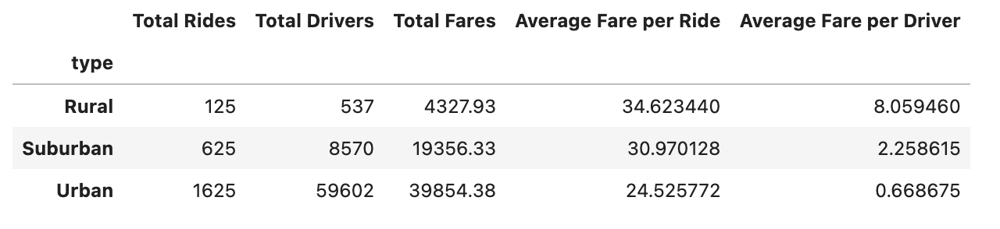

# PyBer_Analysis

## Project Overview
The task of this assignment from V. Isualize was to create a summary DataFrame of the ride-sharing data by city type. Then, using the same data utilizing both Pandas and Matplotlib to create a multiple-line graph showing the total weekly fares for each city type.

## Resources
- Data Source: city_data.csv
- Data Source: ride_data.csv

## Summary
The analysis of the data shows that a majority of the rides that make the most profit would be from the Urban core and that most riders are in the Urban or city. However, the most profit per driver is made in the Rural area but that can be contributed to the distance that is traveled between pickups and drops offs. The city offers the most fares due to the number of riders and drivers.

## Challenge Overview
The challenge included taking two data sources and merging them into one data source to extrapolate the needed information that would suffice the ask. 

This started with using the Pandas functions to get the total number of rides, total number of drivers and the fares for each city type. Then I had to create a multiple line graph that shows the total fares for each week by city type

## Challenge Summary
The data for each city type clearly show that majority of riders are in the city. Which is not all that hard to believe because the majority any major city most of population make up the city.
## Disparities among the city types
 

